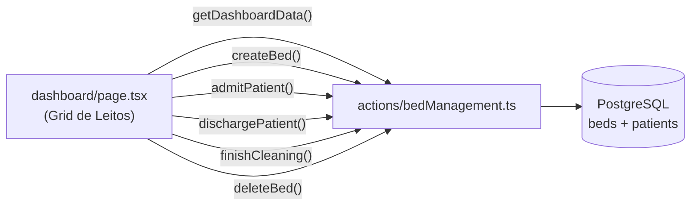

# Relatório Técnico — UTI Care (uti-clone-v0)

> **Data:** 30/05/2026 | **Escopo:** Varredura completa do workspace

---

## 1. Prisma Schema — Análise de Models e Tabelas

**Arquivo:** [schema.prisma](file:///c:/Users/Snaka/OneDrive/Área de Trabalho/uti-clone-v0/uti-clone-v0/prisma/schema.prisma)

### 1.1 Resumo Estrutural

| Model / Enum        | Tabela PostgreSQL       | Campos | Status |
|----------------------|-------------------------|--------|--------|
| `User`              | `users`                 | 6      | ✅ OK  |
| `Doctor`            | `doctors`               | 7      | ✅ OK  |
| `Patient`           | `patients`              | 10     | ✅ OK  |
| `Bed`               | `beds`                  | 8      | ✅ OK  |
| `ClinicalEvolution` | `clinical_evolutions`   | 37     | ✅ OK  |
| `DraftEvolution`    | `draft_evolutions`      | 7      | ✅ OK  |
| `BedStatus` (enum)  | —                       | 4      | ✅ OK  |
| `Sex` (enum)        | —                       | 3      | ✅ OK  |
| `StaffRole` (enum)  | —                       | 4      | ✅ OK  |

### 1.2 Observações sobre o Schema

> [!WARNING]
> **`datasource db` sem `url`:** O bloco `datasource db` define `provider = "postgresql"` mas **não** declara `url = env("DATABASE_URL")`. A conexão funciona porque o `lib/prisma.ts` usa o adapter `PrismaPg` com `connectionString` manual, mas isso é um padrão não-convencional.

- **Relação `User ↔ Doctor` inexistente.** O model `User` (autenticação) não tem FK para `Doctor`. Isso significa que ao salvar uma evolução, o `doctor_id` é **hardcoded** (`HARDCODED_DOCTOR_ID = 1`) em [saveEvolution.ts](file:///c:/Users/Snaka/OneDrive/Área de Trabalho/uti-clone-v0/uti-clone-v0/app/actions/saveEvolution.ts#L28).

- **`DraftEvolution`** está modelada mas **nenhuma Server Action** implementa CRUD de rascunhos. O form de evolução salva direto como `ClinicalEvolution`.

- **Relacionamentos modelados corretamente:**
  - `Bed ↔ Patient` → 1:1 via `current_patient_id` (unique)
  - `Patient → ClinicalEvolution` → 1:N
  - `Doctor → ClinicalEvolution` → 1:N
  - `Bed → ClinicalEvolution` → 1:N

- **Índices de performance OK:** `@@index([patient_id, created_at(sort: Desc)])`, `@@index([bed_id])`, `@@index([doctor_id])`.

---

## 2. Consumo de Dados Estáticos (Mock Data)

### 2.1 `lib/mockUsers.ts` — Credenciais de Protótipo

| Consumidor | Arquivo | O que usa |
|------------|---------|-----------|
| **Login Page** | [app/login/page.tsx](file:///c:/Users/Snaka/OneDrive/Área de Trabalho/uti-clone-v0/uti-clone-v0/app/login/page.tsx) | Importa `StaffRole` type + exibe credenciais de demo no UI (ROLE_CONFIG com emails/senhas hardcoded) |
| **Mock Auth Action** | [app/actions/mockAuth.ts](file:///c:/Users/Snaka/OneDrive/Área de Trabalho/uti-clone-v0/uti-clone-v0/app/actions/mockAuth.ts) | Chama `findMockUserByEmail()` para validar login contra array in-memory |

> [!IMPORTANT]
> **A página de login usa `mockLogin`** (não `login`). A action real com Prisma+bcrypt em `auth.ts` existe mas **NÃO está conectada** à UI.

### 2.2 `app/admin/lib/mockData.ts` — Painel Administrativo Inteiro

Este arquivo alimenta **todo o painel `/admin`** com dados fabricados:

| Componente | Arquivo | Dados Mock Consumidos |
|------------|---------|----------------------|
| **Admin Page** | [app/admin/page.tsx](file:///c:/Users/Snaka/OneDrive/Área de Trabalho/uti-clone-v0/uti-clone-v0/app/admin/page.tsx) | `getPatientsByHospital()`, `getActivitiesByHospital()`, `DailyPatient` |
| **DoctorWelcome** | [DoctorWelcome.tsx](file:///c:/Users/Snaka/OneDrive/Área de Trabalho/uti-clone-v0/uti-clone-v0/app/admin/components/DoctorWelcome.tsx) | `MOCK_DOCTOR` (nome, CRM, etc.) |
| **HospitalsPanel** | [HospitalsPanel.tsx](file:///c:/Users/Snaka/OneDrive/Área de Trabalho/uti-clone-v0/uti-clone-v0/app/admin/components/HospitalsPanel.tsx) | `MOCK_HOSPITALS` |
| **HospitalContext** | [HospitalContext.tsx](file:///c:/Users/Snaka/OneDrive/Área de Trabalho/uti-clone-v0/uti-clone-v0/app/admin/components/HospitalContext.tsx) | `MOCK_HOSPITALS`, `DEFAULT_HOSPITAL_ID` |
| **TodayPatientsCard** | [TodayPatientsCard.tsx](file:///c:/Users/Snaka/OneDrive/Área de Trabalho/uti-clone-v0/uti-clone-v0/app/admin/components/TodayPatientsCard.tsx) | `DailyPatient[]` via props |
| **ActivityFeed** | [ActivityFeed.tsx](file:///c:/Users/Snaka/OneDrive/Área de Trabalho/uti-clone-v0/uti-clone-v0/app/admin/components/ActivityFeed.tsx) | `ActivityEntry[]` via props |
| **KpiCard** | [KpiCard.tsx](file:///c:/Users/Snaka/OneDrive/Área de Trabalho/uti-clone-v0/uti-clone-v0/app/admin/components/KpiCard.tsx) | KPIs calculados de pacientes mock |

> [!CAUTION]
> **O painel admin é 100% mock.** Nenhuma query Prisma é feita. Todos os dados (hospitais, pacientes, atividades, perfil do médico) são arrays estáticos importados de `mockData.ts`.

---

## 3. Server Actions — Estado de Integração com Prisma

**Pasta:** [app/actions/](file:///c:/Users/Snaka/OneDrive/Área de Trabalho/uti-clone-v0/uti-clone-v0/app/actions)

| Action | Arquivo | Usa Prisma? | Estado |
|--------|---------|-------------|--------|
| `login()` | [auth.ts](file:///c:/Users/Snaka/OneDrive/Área de Trabalho/uti-clone-v0/uti-clone-v0/app/actions/auth.ts) | ✅ Sim | Pronta — busca user no DB, compara bcrypt, cria sessão JWT com role |
| `mockLogin()` | [mockAuth.ts](file:///c:/Users/Snaka/OneDrive/Área de Trabalho/uti-clone-v0/uti-clone-v0/app/actions/mockAuth.ts) | ❌ Não | Protótipo — valida contra `MOCK_STAFF_USERS` in-memory |
| `register()` | [register.ts](file:///c:/Users/Snaka/OneDrive/Área de Trabalho/uti-clone-v0/uti-clone-v0/app/actions/register.ts) | ✅ Sim | Pronta — cria user com bcrypt hash, validação completa, enum StaffRole |
| `getDashboardData()` | [bedManagement.ts](file:///c:/Users/Snaka/OneDrive/Área de Trabalho/uti-clone-v0/uti-clone-v0/app/actions/bedManagement.ts) | ✅ Sim | Pronta — 7 funções completas (CRUD leitos, admissão, alta, limpeza) |
| `getBedDetails()` etc. | [patientData.ts](file:///c:/Users/Snaka/OneDrive/Área de Trabalho/uti-clone-v0/uti-clone-v0/app/actions/patientData.ts) | ✅ Sim | Pronta — 4 funções (detalhes do leito, busca paciente, última evolução, salvar dados) |
| `saveEvolution()` | [saveEvolution.ts](file:///c:/Users/Snaka/OneDrive/Área de Trabalho/uti-clone-v0/uti-clone-v0/app/actions/saveEvolution.ts) | ✅ Sim | ⚠️ Parcial — usa Prisma mas `doctor_id` é hardcoded (`= 1`) |

> [!NOTE]
> **5 de 6 actions usam Prisma.** Apenas `mockAuth.ts` é totalmente mock. O código real de login (`auth.ts`) existe e está pronto — basta trocar o import no `login/page.tsx`.

---

## 4. Mapeamento do Fluxo Clínico — Arquivos Principais

### 4.1 Fluxo de Leitos (Bed Management)

| Arquivo | Função |
|---------|--------|
| [dashboard/page.tsx](file:///c:/Users/Snaka/OneDrive/Área de Trabalho/uti-clone-v0/uti-clone-v0/app/dashboard/page.tsx) | Grid de leitos com stats (ocupação, livres, internados), filtro por status, modal de admissão |
| [actions/bedManagement.ts](file:///c:/Users/Snaka/OneDrive/Área de Trabalho/uti-clone-v0/uti-clone-v0/app/actions/bedManagement.ts) | 7 Server Actions: `getDashboardData`, `createBed`, `admitPatient`, `dischargePatient`, `finishCleaning`, `setBedToCleaning`, `deleteBed` |

### 4.2 Fluxo de Pacientes (Patient Data)

| Arquivo | Função |
|---------|--------|
| [dashboard/[bedId]/page.tsx](file:///c:/Users/Snaka/OneDrive/Área de Trabalho/uti-clone-v0/uti-clone-v0/app/dashboard/[bedId]/page.tsx) | Prontuário do paciente, accordion de evoluções, card de dados, ações clínicas |
| [PatientEditModal.tsx](file:///c:/Users/Snaka/OneDrive/Área de Trabalho/uti-clone-v0/uti-clone-v0/app/dashboard/[bedId]/PatientEditModal.tsx) | Modal de edição dos dados do paciente (nome, gênero, altura, nascimento, observações) |
| [calculateAge.tsx](file:///c:/Users/Snaka/OneDrive/Área de Trabalho/uti-clone-v0/uti-clone-v0/app/dashboard/[bedId]/calculateAge.tsx) | Utilitário para calcular idade a partir de birth_date |
| [actions/patientData.ts](file:///c:/Users/Snaka/OneDrive/Área de Trabalho/uti-clone-v0/uti-clone-v0/app/actions/patientData.ts) | 4 Server Actions: `getBedDetails`, `getPatientFromBed`, `getLastEvolution`, `savePatientData` |

### 4.3 Fluxo de Evoluções Clínicas

| Arquivo | Função |
|---------|--------|
| [evolution/page.tsx](file:///c:/Users/Snaka/OneDrive/Área de Trabalho/uti-clone-v0/uti-clone-v0/app/dashboard/[bedId]/evolution/page.tsx) | Formulário stepper multi-etapa para registro de evolução clínica |
| [RespiratoryForm.tsx](file:///c:/Users/Snaka/OneDrive/Área de Trabalho/uti-clone-v0/uti-clone-v0/app/dashboard/[bedId]/evolution/components/forms/RespiratoryForm.tsx) | Formulário respiratório (via aérea, suporte, SpO2, SaO2, RX) |
| [NeurologicalForm.tsx](file:///c:/Users/Snaka/OneDrive/Área de Trabalho/uti-clone-v0/uti-clone-v0/app/dashboard/[bedId]/evolution/components/forms/NeurologicalForm.tsx) | Formulário neurológico (sedação, RASS, Glasgow, pupilas, BIS) |
| [HemodynamicsForm.tsx](file:///c:/Users/Snaka/OneDrive/Área de Trabalho/uti-clone-v0/uti-clone-v0/app/dashboard/[bedId]/evolution/components/forms/HemodynamicsForm.tsx) | Formulário hemodinâmico (drogas vasoativas, PAM, FC, lactato) |
| [NutritionForm.tsx](file:///c:/Users/Snaka/OneDrive/Área de Trabalho/uti-clone-v0/uti-clone-v0/app/dashboard/[bedId]/evolution/components/forms/NutritionForm.tsx) | Formulário nutricional (dieta, resíduo, evacuação, abdome) |
| [RenalForm.tsx](file:///c:/Users/Snaka/OneDrive/Área de Trabalho/uti-clone-v0/uti-clone-v0/app/dashboard/[bedId]/evolution/components/forms/RenalForm.tsx) | Formulário renal/metabólico (diurese, diálise, glicemia, insulina) |
| [HematoinfectiousForm.tsx](file:///c:/Users/Snaka/OneDrive/Área de Trabalho/uti-clone-v0/uti-clone-v0/app/dashboard/[bedId]/evolution/components/forms/HematoinfectiousForm.tsx) | Formulário hematoinfeccioso (ATB, culturas, temperatura) |
| [ProphylaxisForm.tsx](file:///c:/Users/Snaka/OneDrive/Área de Trabalho/uti-clone-v0/uti-clone-v0/app/dashboard/[bedId]/evolution/components/forms/ProphylaxisForm.tsx) | Formulário de profilaxias (TEV, IBP, outros) |
| [generateEvolutionText.ts](file:///c:/Users/Snaka/OneDrive/Área de Trabalho/uti-clone-v0/uti-clone-v0/app/dashboard/[bedId]/evolution/utils/generateEvolutionText.ts) | Gerador de texto consolidado da evolução clínica |
| [EvolutionSummaryModal.tsx](file:///c:/Users/Snaka/OneDrive/Área de Trabalho/uti-clone-v0/uti-clone-v0/app/dashboard/[bedId]/evolution/components/EvolutionSummaryModal.tsx) | Modal de preview/resumo antes de salvar |
| [SmartTextArea.tsx](file:///c:/Users/Snaka/OneDrive/Área de Trabalho/uti-clone-v0/uti-clone-v0/app/dashboard/[bedId]/evolution/components/SmartTextArea.tsx) | Textarea inteligente com UX aprimorada |
| [actions/saveEvolution.ts](file:///c:/Users/Snaka/OneDrive/Área de Trabalho/uti-clone-v0/uti-clone-v0/app/actions/saveEvolution.ts) | Mapeamento completo form→banco, salva `ClinicalEvolution` e atualiza peso do paciente |

### 4.4 Fluxo de Autenticação

| Arquivo | Função |
|---------|--------|
| [login/page.tsx](file:///c:/Users/Snaka/OneDrive/Área de Trabalho/uti-clone-v0/uti-clone-v0/app/login/page.tsx) | Tela de login split-screen com seletor de roles |
| [register/](file:///c:/Users/Snaka/OneDrive/Área de Trabalho/uti-clone-v0/uti-clone-v0/app/register) | Tela de registro de novo usuário |
| [middleware.ts](file:///c:/Users/Snaka/OneDrive/Área de Trabalho/uti-clone-v0/uti-clone-v0/middleware.ts) | RBAC middleware — protege rotas, redireciona por role |
| [lib/session.ts](file:///c:/Users/Snaka/OneDrive/Área de Trabalho/uti-clone-v0/uti-clone-v0/lib/session.ts) | JWT (jose) — create/verify/delete session cookies |
| [lib/prisma.ts](file:///c:/Users/Snaka/OneDrive/Área de Trabalho/uti-clone-v0/uti-clone-v0/lib/prisma.ts) | Prisma Client singleton com adapter PrismaPg |

---

## 5. Observações Críticas para MVP 100% Funcional

### 🔴 Bloqueantes (Impedem uso real)

1. **Login usa mock, não Prisma.** A `login/page.tsx` chama `mockLogin()` em vez de `login()`. Para conectar ao banco, basta trocar o import de `mockAuth` → `auth` e remover as credenciais de demo do UI.

2. **`doctor_id` hardcoded em `saveEvolution.ts`.** A linha `const HARDCODED_DOCTOR_ID = 1` impede que a evolução seja atribuída ao médico logado. **Solução:** Ler o `userId` da sessão JWT → buscar Doctor por `user_id` → usar esse `doctor_id`.

3. **Relação `User ↔ Doctor` não existe.** O schema não tem FK de `User` para `Doctor`. Para resolver o item 2 acima, precisa de:
   - Adicionar `user_id` referenciando `User.id` no model `Doctor`, ou
   - Unificar os models (se Doctor sempre for User).

4. **Painel Admin (`/admin`) é 100% mock.** Todos os componentes consomem `app/admin/lib/mockData.ts`. Precisa de:
   - Model `Hospital` no Prisma (não existe)
   - Server Actions para buscar pacientes do médico logado
   - Server Actions para buscar atividades/feed em tempo real

5. **Erro de sintaxe em `saveEvolution.ts` linha 30:** O texto `wwwwwwwwwwwwwwwwwww` está concatenado no final da assinatura da função. Isso causará erro de compilação.

### 🟡 Melhorias Importantes (MVP funcional mas incompleto)

6. **`DraftEvolution` não tem CRUD.** O model existe no Prisma mas nenhuma action implementa salvar/restaurar rascunhos. O formulário de evolução perde dados se o usuário sair sem salvar.

7. **Filtro de leitos quebrado no dashboard.** Na [dashboard/page.tsx L140-142](file:///c:/Users/Snaka/OneDrive/Área de Trabalho/uti-clone-v0/uti-clone-v0/app/dashboard/page.tsx#L140-L142), quando `filterStatus !== 'all'`, `filteredBeds` é `null` (renderiza nada). Precisa implementar `beds.filter(b => b.status === filterStatus)`.

8. **Seed não cria Doctor.** O [seed.ts](file:///c:/Users/Snaka/OneDrive/Área de Trabalho/uti-clone-v0/uti-clone-v0/prisma/seed.ts) cria apenas Users. Como `saveEvolution` usa `doctor_id = 1`, precisa de pelo menos 1 Doctor no seed.

9. **Seed usa senha `123456`** mas o login/page exibe senhas diferentes (ex: `Medico@2026`). Discrepância confusa para testes.

10. **`datasource db` sem `url`.** O `schema.prisma` não tem `url = env("DATABASE_URL")`, o que pode quebrar comandos como `prisma migrate` e `prisma db push`.

### 🟢 Itens Prontos

- ✅ **Dashboard de leitos** — Completamente integrado com Prisma
- ✅ **Admissão/Alta/Limpeza** — Ciclo completo via transactions
- ✅ **Prontuário do paciente** — Busca e edição via Prisma
- ✅ **Formulário de evolução** — 7 sub-forms mapeados para `ClinicalEvolution`
- ✅ **Geração de texto** — `generateEvolutionText.ts` consolida toda evolução
- ✅ **Registro de usuário** — Com bcrypt e validação completa
- ✅ **Middleware RBAC** — Protege rotas por role via JWT
- ✅ **Testes unitários** — Suite de testes para forms (RespiratoryForm, RenalForm, NutritionForm, ProphylaxisForm)

---

## Resumo Executivo

| Métrica | Valor |
|---------|-------|
| **Models Prisma** | 6 models, 3 enums |
| **Server Actions** | 6 arquivos, ~16 funções |
| **Integração Prisma** | 5/6 actions (83%) |
| **Cobertura Mock** | Login page + Admin panel inteiro |
| **Forms de Evolução** | 7 formulários clínicos completos |
| **Bloqueantes para MVP** | 5 itens críticos |
| **% Funcional estimado** | ~65% (Dashboard + Evolução funcionam; Login + Admin são mock) |
